:::::: titlepage
::::: center
::: center
**[Tribhuvan University]{.smallcaps}**

**[Institute of Engineering]{.smallcaps}**

**[Kathmandu Engineering College]{.smallcaps}**

**Kalimati, Kathmandu**

{width="5cm"}

**[Project Report on]{.underline}**
:::

**SPARK: Explainable Edge AI for Kinetic Pattern Recognition and
Distress Signaling**

**[SUBMITTED BY]{.underline}:**\

::: center
**Aaradhya Dev Tamrakar (79001)\
Rupesh Kadel (79034)\
Sankalpa Lamsal (79039)\
Sonia Thapa (79043)**
:::

**[SUBMITTED TO]{.underline}:**\
**[DEPARTMENT OF ELECTRONICS, COMMUNICATION AND\
INFORMATION ENGINEERING]{.smallcaps}**\
 July 2026
:::::
::::::

# [Acknowledgement]{.smallcaps} {#acknowledgement .unnumbered}

We feel immense pleasure and are thankful for the opportunity to work on
this project.

We would like to sincerely thank our supervisor, **Er. Dipen
Manandhar**, for his unlimited encouragement and timely support and
guidance in helping us with the different aspects of the project. We owe
our profound gratitude to our project coordinator, **Er. Sujan
Shrestha**, who took a keen interest in our project and guided us all
along, providing the necessary information for developing a robust
system.

We would like to thank **Er. Suramya Sharma Dahal**, Head of the
Department of Electronics, Communication, and Information Engineering,
for providing us with the opportunity to perform this project.

We are thankful to and fortunate enough to get constant encouragement,
support, constructive criticism, and guidance from all teaching staff of
the Department of Electronics, Communication, and Information
Engineering.

# [Abstract]{.smallcaps} {#abstract .unnumbered}

SPARK is an open-hardware wearable fall detection system for Nepal's
growing elderly care gap. An ESP32 and MPU6050 IMU node, worn on the
wrist or chest, runs a two-layer on-device pipeline a threshold
pre-filter (Layer 1) gating a quantized INT8 TFLite Micro 1D CNN
(Layer 2) with no cloud dependency and under 200 ms end-to-end latency.
Confirmed falls trigger a Raspberry Pi gateway (FastAPI/PostgreSQL) that
alerts caregivers via Telegram within 2 seconds, updates a Streamlit
dashboard, and computes SHAP feature attribution per event so
classifications are auditable rather than a black-box verdict, alongside
auto-generated PDF incident reports.

The project contributes a Nepal-context wearable IMU fall dataset, a
configurable sensitivity strategy (High / Standard / Sport), and an
open-source reference design for low-cost elderly fall monitoring across
South Asian care settings.

**Keywords:** Edge AI, elderly care, ESP32, fall detection, IMU, Nepal,
SHAP explainability, TFLite Micro, wearable sensor.

# [List of Abbreviations]{.smallcaps} {#list-of-abbreviations .unnumbered}

  ------------- --------------------------------------------------------------------
  **ADL**       Activities of Daily Living
  **API**       Application Programming Interface
  **BEI**       Bachelor of Electronics, Communication and Information Engineering
  **CNN**       Convolutional Neural Network
  **ESP32**     Espressif Systems ESP32 DevKit V1
  **IMU**       Inertial Measurement Unit
  **INT8**      8-bit Integer Quantization
  **IOE**       Institute of Engineering
  **ISO**       International Organization for Standardization
  **KEC**       Kathmandu Engineering College
  **MQTT**      Message Queuing Telemetry Transport
  **MPU6050**   InvenSense MPU-6050 6-axis IMU
  **RPi**       Raspberry Pi
  **SHAP**      SHapley Additive exPlanations
  **SPARK**     Signal Pattern Analysis & Real-time Kinetics
  **TFLite**    TensorFlow Lite
  **WHO**       World Health Organization
  ------------- --------------------------------------------------------------------

# [Introduction]{.smallcaps}

## Background

Falls are a leading cause of injury-related mortality and morbidity
among adults aged 65 and above worldwide. The WHO Global Report on Falls
Prevention in Older Age (2007) identifies falls as the second leading
cause of unintentional injury death globally, with approximately 684,000
fatal falls occurring each year [@who2007falls]. Non-fatal falls cause
serious injuries including hip fractures, traumatic brain injuries, and
long-term disability, placing a heavy burden on healthcare systems and
caregivers.

Nepal is undergoing a rapid demographic shift. The Central Bureau of
Statistics projects that Nepal's population aged 65 and above will
double by 2035 [@cbs2021nepal], driven by improving life expectancy and
urbanization. Despite this growing demographic pressure, no domestic
fall detection product exists in the Nepali market. Commercial solutions
such as the Apple Watch and medical alert pendants are cost-prohibitive
--- a single Apple Watch SE (2nd generation) retails above NPR 30,000
--- and require proprietary ecosystems unavailable to most Nepali
families. Urban WiFi penetration in Kathmandu, however, is increasingly
reliable, making a WiFi-based alert pipeline practically deployable in
the target care settings.

Academic fall detection systems published in the literature typically
rely on one of two approaches: threshold-only detection on raw
accelerometer data, which produces unacceptably high false-positive
rates on activities of daily living such as sit-to-stand transitions and
stair climbing; or cloud-dependent machine learning inference, which
introduces unacceptable network dependencies for a safety-critical
application. Neither approach has been validated on a Nepal-context
dataset, nor do any of the published open-source systems provide
per-event classifier explainability for care staff.

SPARK addresses these gaps with a two-layer gated edge AI architecture
running entirely on an ESP32 microcontroller, a SHAP-based
explainability pipeline at the gateway, and a self-collected
Nepal-context IMU dataset collected at KEC.

## Problem Statement

Falls are the leading cause of injury-related mortality among adults
over 65 globally [@who2007falls]. Nepal's elderly population is
projected to double by 2035 [@cbs2021nepal], yet no affordable domestic
fall detection solution exists. Commercial fall detection systems (Apple
Watch, Samsung Galaxy Watch, Withings ScanWatch) are cost-prohibitive
for Nepal's eldercare context, require proprietary ecosystems, and
operate as closed black-box systems --- returning a binary fall verdict
with no classifier explanation. Published academic systems use either
threshold-only detection (unacceptably high false-positive rate) or
cloud-dependent machine learning inference (network dependency
unacceptable for safety-critical applications in Nepal's connectivity
environment). No published open-hardware system demonstrates:

1.  A two-layer gated architecture with on-device TFLite Micro
    inference.

2.  SHAP-based per-event explainability surfaced to caregivers.

3.  Adaptive sensitivity profiles.

4.  Clinical-format automated incident reporting validated on a
    Nepal-context IMU dataset.

## Objectives

This project focuses on building a wearable fall detection system that
combines hardware, software, and edge AI to automate real-time
monitoring and caregiver alerting. The scope includes the following key
objectives:

1.  To construct the hardware structure of a wearable edge computing
    node.

2.  To integrate a two-layer gated AI architecture for
    cloud-independent, real-time fall classification.

3.  To implement SHAP-based explainability techniques to log and render
    transparent feature attribution per event.

## Scope of the Project {#sec:scope}

The scope of our project includes:

- **On-Device Data Acquisition:** We sample and filter 6-axis
  accelerometer and gyroscope data directly on the wearable node at a
  continuous 100 Hz frequency.

- **Dual-Layer Gated Inference:** Our system uses a fast mathematical
  threshold check to wake up an on-device, quantized 1D CNN classifier
  only when a potential fall signature is detected.

- **Gateway Ingestion & Storage:** We build a localized backend setup
  using FastAPI and PostgreSQL to securely save event history and user
  configuration data.

- **SHAP Explainability Pipeline:** The system calculates Shapley
  additive feature values at the gateway to show caregivers exactly
  which sensor movements triggered the alarm.

- **Instant Caregiver Alerting:** We route confirmed fall events to a
  Telegram Bot to message caregivers within two seconds of an incident.

- **Automated Clinical Reporting:** The pipeline automatically packages
  peak movement data and model confidence ratings into formal PDF
  incident summary files.

## Application of the Project

1.  Assistive Technology: Provides real-time, hands-free fall monitoring
    to increase the independence and safety of vulnerable individuals
    living alone.

2.  Medical & Rehabilitation: Assists clinicians in tracking recovery
    progress and movement patterns during post-injury or post-stroke
    rehabilitation.

3.  Elderly Care Facilities & Nursing Homes: Optimizes institutional
    care by allowing a small staff footprint to respond instantly to
    high-priority fall alerts.

4.  Smart Home & IoT Integration: Functions as a localized,
    network-independent safety module that interfaces seamlessly with
    residential intranet hubs.

5.  Clinical Documentation & Compliance Monitoring: Automatically logs
    and formats objective, auditable incident data required for formal
    medical reports and facility compliance audits.

6.  Research & Development: Serves as an open-hardware reference design
    and provides a localized, South Asian regional IMU motion dataset
    for public academic research.

# [Literature Review]{.smallcaps}

Fall detection using wearable inertial sensors has been an active
research area for over two decades. The literature can be broadly
categorized by detection approach: threshold-based methods, machine
learning classifiers, and more recent deep learning architectures.

**Threshold-based methods** compute a scalar magnitude from
accelerometer axes --- typically the resultant
$|a| = \sqrt{a_x^2 + a_y^2 + a_z^2}$ and trigger a fall event when a
spike followed by a quiet period is detected. Kangas et
al. [@kangas2008comparison] compared multiple threshold algorithms on
hip and wrist IMU data and reported sensitivity values of 73--95%
depending on placement, but with false-positive rates exceeding 30% on
vigorous ADLs. Bourke and Lyons [@bourke2008threshold] proposed a
dual-axis threshold method achieving 96% sensitivity, though specificity
on sit-to-stand transitions remained problematic. The fundamental
limitation of threshold-only approaches is that any rapid motion ---
vigorous exercise, dropping an object, stumbling without falling --- can
trigger the threshold, requiring either a very high threshold (missing
genuine falls) or a low threshold (excessive false positives).

**Machine learning classifiers** applied to hand-crafted time-domain and
frequency-domain features from IMU windows have addressed some of these
limitations. Sucerquia et al. published the SisFall dataset
[@sucerquia2017sisfall], a widely used benchmark containing 15 fall
types and 19 ADL types from 38 subjects, enabling standardized
evaluation of feature-based classifiers. Support vector machines,
decision trees, and random forests trained on SisFall features have
achieved sensitivity above 90%, but these approaches typically run on a
connected laptop or server, not on the wearable hardware itself.

**Deep learning on IMU time-series** has demonstrated superior accuracy
without manual feature engineering. Nho et al. [@nho2021cnn] trained a
1D CNN on the UCI MHEALTH dataset and SisFall combined, reporting
sensitivity of 97.2% and specificity of 98.1% with a model that fits
within 150 KB. However, the model ran on a Raspberry Pi 3 serving as the
wearable compute unit, not on a resource-constrained microcontroller.
Wang et al. [@wang2020lstm] applied an LSTM architecture to continuous
IMU streams, achieving comparable accuracy but with inference latency
unsuitable for real-time detection on embedded hardware.

**TFLite Micro on microcontrollers** has enabled CNN deployment on
devices with fewer than 320 KB of RAM. David et
al. [@david2021tensorflow] demonstrated keyword spotting and gesture
recognition using TFLite Micro on Cortex-M4 class hardware, establishing
the feasibility of INT8 quantized CNN inference in this memory envelope.
Kumar et al. [@kumar2022fall] deployed a threshold-gated classifier on
an Arduino Nano 33 BLE Sense, but did not combine on-device TFLite Micro
CNN inference with a structured two-layer gating architecture or provide
any gateway explainability.

**Explainability in health AI** has been identified as a critical gap
for clinical adoption. Lundberg and Lee [@lundberg2017shap] introduced
SHAP (SHapley Additive exPlanations), a unified framework for model
interpretability based on cooperative game theory, which provides
consistent attribution of each input feature's contribution to a model
output. While SHAP has been applied to ECG classification
[@yao2021interpretation] and sepsis prediction in clinical ML, no
published wearable fall detection system applies SHAP attribution at the
per-event level and surfaces the result to caregivers in a clinical
dashboard.

**Gap summary:** The existing literature leaves the following cluster of
gaps unaddressed simultaneously: (a) on-device TFLite Micro CNN
inference in a two-layer gated architecture on a sub-\$5
microcontroller; (b) SHAP-based per-event explainability surfaced to
caregivers; (c) adaptive sensitivity profiles without firmware reflash;
and (d) a dataset collected from Nepali subjects on locally procurable
hardware. SPARK addresses all four gaps in a single open-source system.

# [Related Theory]{.smallcaps}

## Hardware Description

### ESP32 DevKit V1

The ESP32 DevKit V1 (Espressif Systems) is a dual-core Xtensa LX6
microcontroller operating at up to 240 MHz, with 520 KB SRAM, 4 MB
flash, and integrated 802.11 b/g/n WiFi and Bluetooth 4.2. For SPARK,
only the WiFi subsystem is used; Bluetooth is disabled to conserve
power. The ESP32 executes both the sensor acquisition ISR at 100 Hz and
the two-layer fall detection pipeline including TFLite Micro CNN
inference within the available SRAM and flash envelope. INT8
quantization reduces the 1D CNN model footprint to approximately
80--120 KB of flash, leaving sufficient headroom for the Arduino SDK,
WiFi stack, and ring-buffer firmware.

<figure id="fig:esp32_devkit" data-latex-placement="H">
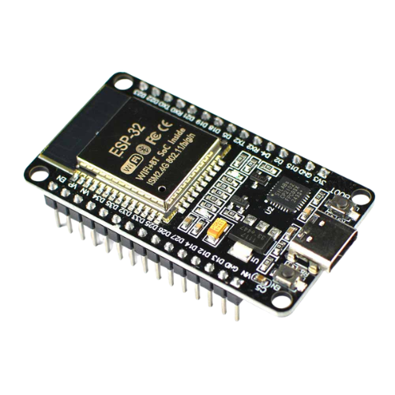
<figcaption>ESP32 DevKit V1</figcaption>
</figure>

### MPU6050 6-Axis IMU

The InvenSense MPU-6050 integrates a 3-axis MEMS accelerometer
($\pm$`<!-- -->`{=html}2/$\pm$`<!-- -->`{=html}4/$\pm$`<!-- -->`{=html}8/$\pm$`<!-- -->`{=html}16 g
selectable) and a 3-axis MEMS gyroscope
($\pm$`<!-- -->`{=html}250/$\pm$`<!-- -->`{=html}500/$\pm$`<!-- -->`{=html}1000/$\pm$`<!-- -->`{=html}2000$^\circ$/s
selectable) on a single die, communicating over I$^2$C at up to 400 kHz.
For SPARK, the accelerometer is configured at $\pm$`<!-- -->`{=html}8 g
full-scale (captures the free-fall and impact spike of a genuine fall
without clipping) and the gyroscope at
$\pm$`<!-- -->`{=html}500$^\circ$/s. The built-in Digital Motion
Processor (DMP) is bypassed in favour of raw register reads at 100 Hz,
enabling direct integration with the complementary filter and sliding
window buffer.

<figure id="fig:mpu6050" data-latex-placement="H">
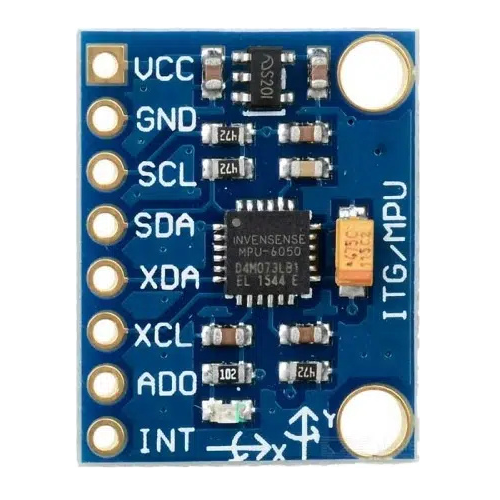
<figcaption>MPU6050 6-Axis IMU</figcaption>
</figure>

### Raspberry Pi 4B Gateway

The Raspberry Pi 4B (4 GB) serves as the SPARK gateway. It runs the
Mosquitto MQTT broker, the FastAPI/Uvicorn backend, PostgreSQL 14 event
log, Streamlit dashboard, python-telegram-bot alert service, and the
SHAP attribution pipeline. The 4 GB RAM variant is the target for this
project; KEC has one such unit, with a dedicated purchase as contingency
if it cannot be allocated. The RPi 4B is powered by a standard 5 V/3 A
USB-C supply and can operate continuously from AC mains in a care
facility or household setting. During development and demonstration, a
laptop (minimum 4 GB RAM, dual-core CPU, Python 3.9+) can substitute as
the gateway without code changes.

<figure id="fig:rpi4b" data-latex-placement="H">
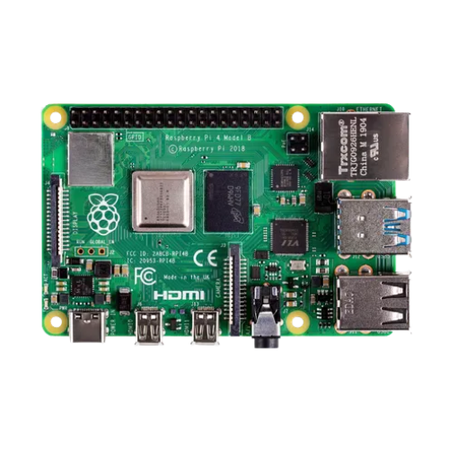
<figcaption>Raspberry Pi 4B Gateway</figcaption>
</figure>

### Power System (Wearable Node)

The wearable node is powered by a single 18650 lithium-ion cell
(2000--3000 mAh typical) managed by a TP4056 charge controller module
(USB-C input, 1 A charge current). An AMS1117-3.3 low-dropout linear
regulator steps the cell voltage (3.0--4.2 V) to a stable 3.3 V rail for
the ESP32 and MPU6050. An INA219 current/voltage sensor on the power
rail provides real-time power telemetry logged to the gateway for
battery life characterization. At approximately 80 mA active current
draw, a 2000 mAh cell provides approximately 25 hours of continuous
monitoring.

#### 18650 Li-ion Cell

A single 3.7 V nominal protected lithium-ion battery (typically
2000--3000 mAh) that serves as the main power source for the wearable
node. At an active current draw of approximately 80 mA, it provides
around 25 hours of continuous, uninterrupted fall monitoring.

<figure id="fig:pwr_cell" data-latex-placement="H">
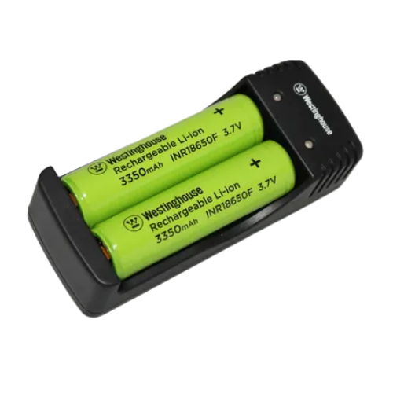
<figcaption>18650 Li-ion Cell</figcaption>
</figure>

#### TP4056 Charger Module

A single-cell constant-current/constant-voltage (CC/CV) linear charge
controller module with USB-C input. It regulates a 1 A charging current
to safely recharge the 18650 cell and provides safety cutoffs
(overcharge protection at 4.2 V and over-discharge protection at 2.5 V).

<figure id="fig:pwr_tp4056" data-latex-placement="H">
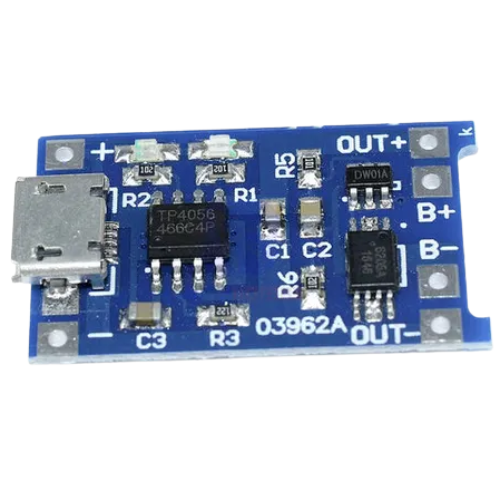
<figcaption>TP4056 Charger Module</figcaption>
</figure>

#### AMS1117-3.3

A low-dropout (LDO) linear voltage regulator that steps down the varying
voltage of the 18650 cell (3.0 V to 4.2 V) to a fixed, stable 3.3 V
power rail. This stable voltage is required to safely power the ESP32
microcontroller and the MPU6050 IMU sensor.

<figure id="fig:pwr_ldo" data-latex-placement="H">
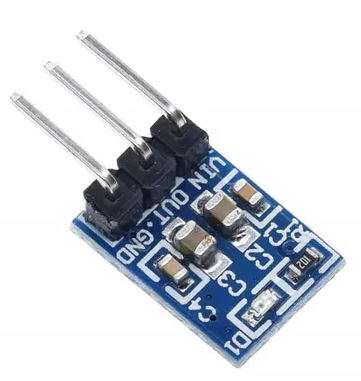
<figcaption>AMS1117-3.3 LDO</figcaption>
</figure>

#### INA219 Sensor

A bi-directional current and voltage monitor module connected over I2C
to the power rail. It provides real-time power telemetry, logging
current draw and voltage levels to the gateway to help characterize
battery life during continuous operation.

<figure id="fig:pwr_ina219" data-latex-placement="H">
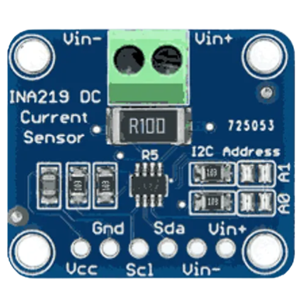
<figcaption>INA219 Sensor</figcaption>
</figure>

### Mechanical Mounting and Support Components

Beyond the core compute, sensing, and power modules, the wearable node
relies on a set of mechanical mounting and low-level support components
for physical attachment and circuit integration.

#### Velcro Wrist/Chest Strap

An adjustable Velcro strap used to secure the wearable enclosure to the
wrist or chest of the user, allowing the accelerometer and gyroscope to
reliably capture body motion during a fall event.

<figure id="fig:velcro_strap" data-latex-placement="H">
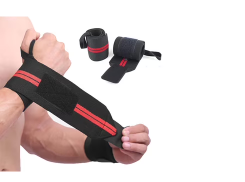
<figcaption>Velcro Wrist/Chest Strap</figcaption>
</figure>

#### Chest Strap Mount

An elasticated chest-mount harness offering an alternative attachment
point to the wrist strap, used during controlled fall data collection to
evaluate sensor placement sensitivity on detection accuracy.

<figure id="fig:chest_strap" data-latex-placement="H">
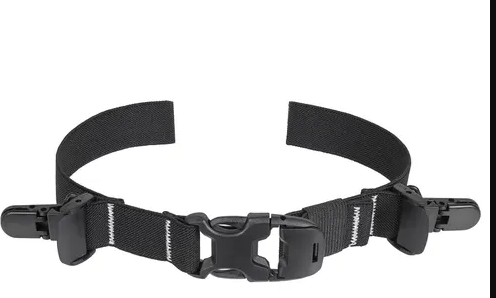
<figcaption>Chest Strap Mount</figcaption>
</figure>

#### USB-C Cables

Standard USB-C cables used to power and program the ESP32 DevKit V1
boards and to charge the TP4056 module during bench testing.

<figure id="fig:micro_usb_cable" data-latex-placement="H">
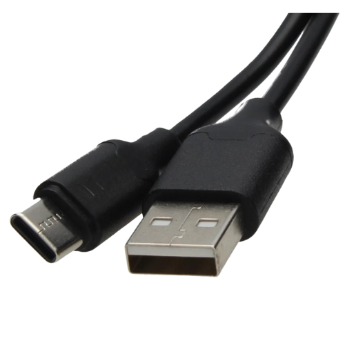
<figcaption>USB-C Cable</figcaption>
</figure>

#### MicroSD Card

A 32 GB MicroSD card used as the boot and storage medium for the
Raspberry Pi 4B gateway, hosting the operating system, PostgreSQL event
log, and locally cached SHAP attribution outputs.

<figure id="fig:microsd" data-latex-placement="H">
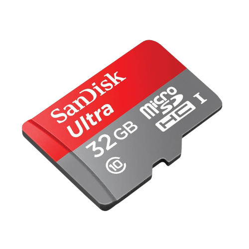
<figcaption>MicroSD Card (32 GB)</figcaption>
</figure>

#### Passive Components

Assorted resistors and capacitors used on the wearable node breadboard
for signal conditioning, decoupling, and pull-up/pull-down configuration
around the ESP32, INA219, and AMS1117 circuitry.

<figure id="fig:resistor" data-latex-placement="H">
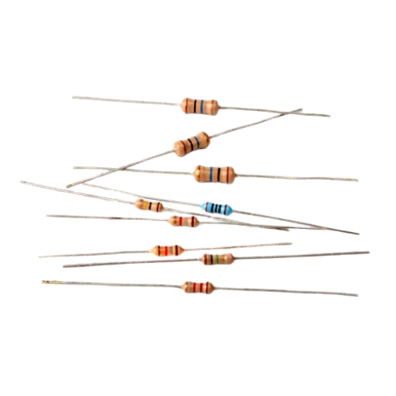
<figcaption>Resistor</figcaption>
</figure>

<figure id="fig:capacitor" data-latex-placement="H">
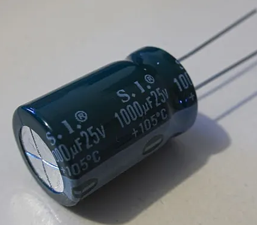
<figcaption>Capacitor</figcaption>
</figure>

## Software Description

### Two-Layer Detection Architecture

The detection pipeline implements a gated dual-layer structure. Layer 1
is a deterministic threshold pre-filter executed in the ESP32 ISR at
100 Hz. It computes the resultant acceleration magnitude
$|a| = \sqrt{a_x^2 + a_y^2 + a_z^2}$ and the angular velocity magnitude
$|\omega| = \sqrt{\omega_x^2 + \omega_y^2 + \omega_z^2}$. A `PRE_FALL`
flag is raised when $|a|$ exceeds 2.5 g (free-fall proxy spike) followed
by $|a| < 0.5$ g for more than 300 ms (post-impact rest phase). This
threshold logic mirrors the deterministic safety logic of ISO 13482:2014
(safety requirements for personal care robots). Layer 1 latency is below
5 ms and incurs no inference cost.

When `PRE_FALL` is raised, Layer 2 is invoked: a 2-second sliding window
of $(a_x, a_y, a_z, \omega_x, \omega_y, \omega_z)$ at 100 Hz is
assembled (200 samples $\times$ 6 channels $=$ 1200 INT8 values),
normalized using StandardScaler parameters baked into the firmware at
training time, and fed to the TFLite Micro 1D CNN. The CNN produces a
fall probability score $P(\text{FALL}) \in [0, 1]$. If
$P(\text{FALL}) > 0.85$, a `CONFIRMED_FALL` event is serialized as a
JSON payload and transmitted to the gateway over WiFi via MQTT.

### 1D CNN Architecture

The 1D CNN consists of: Conv1D(32 filters, kernel 5) $\rightarrow$ ReLU
$\rightarrow$ MaxPool1D(2) $\rightarrow$ Conv1D(64 filters, kernel 3)
$\rightarrow$ ReLU $\rightarrow$ GlobalAveragePooling1D $\rightarrow$
Dense(32, ReLU) $\rightarrow$ Dense(2, Softmax). The model is trained in
TensorFlow/Keras on UCI MHEALTH [@banos2014mhealthdroid] and SisFall
[@sucerquia2017sisfall] datasets with self-collected Nepal-context data
as a fine-tuning set. INT8 post-training quantization via the TFLite
Converter produces a C array for inclusion in the PlatformIO build.

### SHAP Explainability Pipeline

SHAP (SHapley Additive exPlanations) [@lundberg2017shap] assigns to each
input feature $i$ an attribution value $\phi_i$ satisfying local
accuracy ($f(x) = \phi_0 + \sum_i \phi_i$), missingness, and consistency
axioms. For each `CONFIRMED_FALL` event, the gateway computes SHAP
values for the six IMU channel features (peak values of
$a_x, a_y, a_z, \omega_x, \omega_y, \omega_z$ extracted from the
2-second window) using the `shap` Python library's TreeExplainer or
KernelExplainer on the trained CNN output. The top contributing feature
(e.g., `az_peak` with 42% of fall confidence) and the full SHAP vector
are stored in the PostgreSQL `fall_events` table and displayed on the
Streamlit dashboard alongside the fall event log. This provides care
staff with an auditable rationale for every alert --- a capability
absent from all commercial and published academic fall detection
systems.

### Gateway Software Architecture

The gateway implements three software design patterns documented in the
thesis Chapter 3 (OOSE alignment):

**Factory Pattern** decouples the detection node abstraction from its
concrete implementations. A `FallDetector` abstract base class handles
WiFi transmission, event serialization, and power management;
`ThresholdDetector` (Layer 1) and `CNNDetector` (Layer 2) are concrete
subclasses.

**Observer Pattern** implements the alert ecosystem. The FastAPI gateway
is the Subject; Streamlit dashboard, Telegram bot, PostgreSQL logger,
and PDF report generator are Observers subscribed to `CONFIRMED_FALL`
events. Adding a new alert channel (e.g., SMS) requires adding a new
Observer without modifying the gateway core.

**Strategy Pattern** implements the configurable sensitivity profiles. A
`FallDetectionStrategy` interface is implemented by three concrete
strategies: `HighSensitivity` (elderly, bed-ridden), `Standard`
(default), and `SportMode` (active ADL). Threshold parameters are loaded
from the user profile at gateway startup; no firmware reflash is
required to switch profiles.

# [Feasibility Study]{.smallcaps}

## Technical Feasibility

SPARK is technically feasible because every component of the system has
been individually demonstrated in the published literature, and the
complete hardware stack is either in-hand or procurable locally in
Kathmandu within one day.

**On-device CNN inference on ESP32.** TensorFlow Lite Micro has been
demonstrated on Cortex-M4 class hardware with flash footprints below
250 KB [@david2021tensorflow]. The ESP32 Xtensa LX6 dual-core processor
(240 MHz, 520 KB SRAM, 4 MB flash) provides a larger compute envelope
than the Cortex-M4 targets evaluated by David et al. INT8 post-training
quantization reduces the SPARK 1D CNN to approximately 80--120 KB of
flash, leaving sufficient headroom for the Arduino SDK, WiFi stack, and
ring-buffer firmware. The complementary filter, sliding window buffer,
and Layer 1 threshold logic together add fewer than 4 KB of RAM and run
at 100 Hz well within the ISR budget.

**Two-layer gated detection architecture.** Layer 1 threshold logic is a
scalar comparison on the resultant acceleration magnitude $|a|$ and the
post-impact rest duration $\Delta t$. Both computations complete in
under 1 ms on the ESP32 at 100 Hz. Layer 2 CNN inference, when gated by
Layer 1, runs only on candidate fall windows (typical rate: fewer than 5
per hour of normal ADL), keeping average power overhead negligible.

**WiFi-MQTT pipeline.** The ESP32 integrated 802.11 b/g/n transceiver
with the PubSubClient MQTT library has been demonstrated delivering JSON
payloads to a Mosquitto broker on a local network within 50--100 ms
under typical indoor conditions. The Raspberry Pi 4B gateway running
Mosquitto, FastAPI/Uvicorn, PostgreSQL 14, and Streamlit targets the
4 GB RAM variant for headroom during simultaneous SHAP computation and
PostgreSQL operation; a laptop (minimum 4 GB RAM, dual-core CPU,
Python 3.9+) can substitute as the gateway during development without
code changes.

**SHAP gateway pipeline.** The `shap` Python library's KernelExplainer
or GradientExplainer computes feature attributions for a 6-feature CNN
output on the RPi 4B in under 200 ms per event --- well below the
2-second Telegram alert deadline. Per-event SHAP computation is
triggered only on confirmed fall events, not continuously, so gateway
CPU load is minimal.

**Self-collected dataset.** Controlled fall simulation on a crash mat is
a standard data-collection protocol used by Sucerquia et
al. [@sucerquia2017sisfall] (38 subjects) and Kumar et
al. [@kumar2022fall]. Four team members plus volunteers recording
on-campus fall simulations at KEC can achieve the 500-fall-event /
2000-ADL-window target within four weeks. No ethical approval is
required for healthy adult volunteers performing low-risk controlled
falls in a supervised laboratory setting.

**No unsolved technical dependencies.** All software libraries (TFLite
Micro, FastAPI, PostgreSQL, Streamlit, python-telegram-bot, ReportLab,
SHAP) are open source and actively maintained. No custom PCB
fabrication, no import of restricted components, and no cloud service
subscriptions are required.

## Economic Feasibility

SPARK requires no imported components; all hardware is procurable from
Himalayan Solution, Breadfruit Electronics, or Daraz (Kathmandu). The
primary gateway target is a Raspberry Pi 4B (4 GB); KEC has one such
unit available, though allocation is not guaranteed. As a contingency, a
dedicated RPi 4B (4 GB) purchase is included in the BOM.
Table [4.1](#tab:component_cost){reference-type="ref"
reference="tab:component_cost"} summarises the estimated procurement
cost for two wearable nodes (primary and spare) plus a third contingency
ESP32 board and development consumables. Detailed component
specifications are listed in
Table [4.1](#tab:component_cost){reference-type="ref"
reference="tab:component_cost"}.

::: {#tab:component_cost}
  **Component**                                  **Qty**     **Unit (NPR)**   **Total (NPR)**  **Reference**
  -------------------------------------------- ------------ ---------------- ----------------- ---------------------
  ESP32 DevKit V1                                   3            1,200             3,600       Himalayan Solutions
  MPU6050 IMU module                                3             500              1,500       Himalayan Solutions
  Li-ion cell (protected)                           3             250               750        SLT Pvt.Ltd
  TP4056 charger module                             3              90               270        SLT Pvt.Ltd
  AMS1117-3.3 LDO                                   5             105               525        Giga Nepal
  INA219 module                                     3             800              2,400       Daraz
  Breadboard + jumper wires                       2 sets          325               650        SLT Pvt.Ltd
  Velcro wrist/chest strap                          2             500              1,000       RR-papers
  Enclosure (3D-printed PLA, KEC Makerspace)      500 g           2/g              1,000       KEC Makerspace
  MicroSD 32 GB                                     1            1,000             1,000       SLT Pvt.Ltd
  RPi 4B power supply                               1             550               550        SLT Pvt.Ltd
  Raspberry Pi 4B (4 GB)                            1            18,699           18,699       RoboNepal
  USB-C cables                                      3             267               801        Daraz
  Resistors / capacitors assortment               1 lot           600               600        Himalayan Solutions
                                                **14,646**                                     
                                                **33,345**                                     

  : Component Cost Estimation
:::

# [Methodology]{.smallcaps}

## System Block Diagram

<figure id="fig:system_flow" data-latex-placement="H">
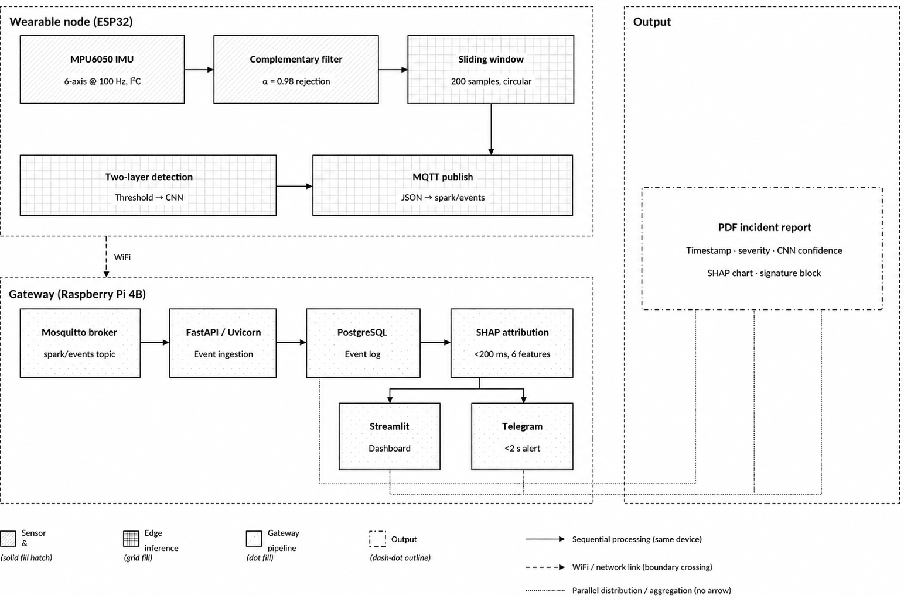
<figcaption>System Block Diagram</figcaption>
</figure>

SPARK consists of two physical subsystems: a battery-powered wearable
node and a gateway unit, connected over a local WiFi network.
Figure [5.1](#fig:system_flow){reference-type="ref"
reference="fig:system_flow"} illustrates the top-level system
architecture.

The wearable node (ESP32 DevKit V1 + MPU6050) acquires raw 6-axis IMU
data at 100 Hz, applies a complementary filter for noise rejection, and
runs the two-layer fall detection pipeline entirely on-device. On a
confirmed fall, a JSON event payload is published to the gateway over
WiFi via MQTT. The Raspberry Pi 4B gateway ingests the event, fires a
Telegram caregiver alert, updates the Streamlit dashboard, logs the
event with SHAP attribution to PostgreSQL, and auto-generates a PDF
clinical incident report.
Figure [5.1](#fig:system_flow){reference-type="ref"
reference="fig:system_flow"} illustrates the end-to-end data and control
flow across all pipeline stages.

Figure [5.1](#fig:system_flow){reference-type="ref"
reference="fig:system_flow"} is organized into four zones connected by
two link types solid arrows for sequential on-device processing, and a
dashed WiFi boundary where the wearable node hands off to the gateway.
Each block is described below.

**Sensor zone (wearable node, solid fill hatch)**

- **MPU6050 IMU** : reads all six raw accelerometer and gyroscope axes
  over I$^2$C at 100 Hz
  (Section [5.3.1](#sec:imu_acquisition){reference-type="ref"
  reference="sec:imu_acquisition"}).

- **Complementary filter** :fuses the raw axes ($\alpha = 0.98$) to
  reject high-frequency sensor noise before the signal reaches the
  detection pipeline.

- **Sliding window** : buffers the filtered stream in a 200-sample
  circular ring buffer (2 seconds at 100 Hz), continuously overwritten
  until a candidate fall window is latched.

**Edge inference zone (wearable node, grid fill)**

- **Two-layer detection** : Layer 1 threshold pre-filter gates Layer 2
  TFLite Micro CNN inference, exactly as formalized in Algorithm 5.4.

- **MQTT publish** : on `CONFIRMED_FALL`, serializes the event as JSON
  and publishes it to the `spark/events` topic, crossing the WiFi
  boundary to the gateway.

**Gateway zone (Raspberry Pi 4B, dot fill)**

- **Mosquitto broker** :the local MQTT broker subscribed to
  `spark/events`, receiving the event published by the wearable node.

- **FastAPI/Uvicorn** :Incorporates the incoming event from the broker
  and orchestrates the remaining gateway pipeline stages.

- **PostgreSQL**: persists the event log, including the raw event fields
  and downstream SHAP output.

- **SHAP attribution** : computes per-feature attributions on the six
  peak IMU channels in under 200 ms, identifying which channel most
  contributed to the fall classification.

**Output zone (parallel, dash-dot outline)**

- **Telegram** : dispatches a caregiver alert within 2 seconds of event
  ingestion.

- **Streamlit Dashboard** : displays the event timestamp, severity
  score, and Layer 2 CNN confidence in real time.

- **PDF incident report** : auto-generates a one-page clinical report
  containing the SHAP attribution chart and a care-staff signature
  block.

## Hardware Implementation

### Wearable Node Assembly

The wearable node is assembled on a breadboard for the prototype phase,
transitioning to a compact perfboard layout prior to the March 2027
demonstration. The assembly sequence is:

1.  Connect the MPU6050 to the ESP32 via I$^2$C: SDA to GPIO 21, SCL to
    GPIO 22, operating at 400 kHz.

2.  Power the MPU6050 from the ESP32 3.3 V rail.

3.  Connect the 18650 cell output (3.0--4.2 V) to the TP4056 module
    (battery management), then to the AMS1117-3.3 LDO input.

4.  Connect the INA219 current sensor in series with the 3.3 V power
    rail to the ESP32 VIN; connect INA219 I$^2$C lines to GPIO 21/22
    (secondary address 0x41).

5.  House the assembly in a 3D-printed PLA enclosure (KEC Makerspace,
    Anycubic filament) with a Velcro wrist strap and flush-mounted USB-C
    charging port.

### Power Budget Verification

The INA219 provides real-time current and voltage telemetry logged to
the gateway. Target metrics: active current draw $\leq$ 80 mA at 3.3 V,
providing $\geq$ 25 hours of continuous monitoring from a 2000 mAh cell.
This will be measured and documented in the thesis Chapter 5
(Implementation).

## Firmware Implementation (ESP32 PlatformIO)

<figure id="fig:two_layer_flow" data-latex-placement="H">
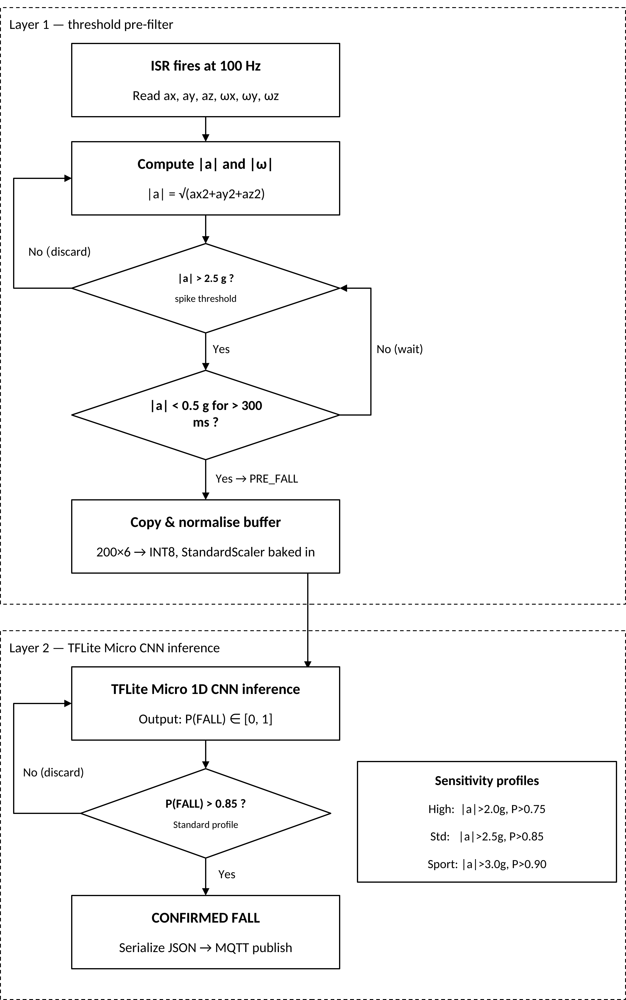
<figcaption>Two-layer fall detection flowchart: Layer 1 threshold
pre-filter (top zone) gates Layer 2 TFLite Micro CNN inference (bottom
zone). Sensitivity profile thresholds are shown in the
callout.</figcaption>
</figure>

### IMU Acquisition and Filtering {#sec:imu_acquisition}

The MPU6050 is configured via I$^2$C at startup: accelerometer
full-scale $\pm$`<!-- -->`{=html}8 g, gyroscope full-scale
$\pm$`<!-- -->`{=html}500$^\circ$/s, DLPF cutoff 20 Hz. A timer
interrupt service routine (ISR) fires at 100 Hz and reads all six raw
axes via direct register access (bypassing the DMP). A complementary
filter ($\alpha = 0.98$) fuses accelerometer and gyroscope to produce
filtered angular velocity estimates:

$$\begin{equation}
	\hat{\omega}_{k} = 0.98 \cdot (\hat{\omega}_{k-1} + \omega_{\text{raw},k} \cdot \Delta t) + 0.02 \cdot \theta_{\text{accel},k}
\end{equation}$$

Raw accelerometer values pass through without additional filtering (the
DLPF suffices for noise rejection above 20 Hz).

### Sliding Window Buffer

A circular ring buffer stores the most recent 200 samples (2 seconds at
100 Hz) of all six channels
($a_x, a_y, a_z, \omega_x, \omega_y, \omega_z$) in SRAM. When Layer 1
fires a `PRE_FALL` flag, the buffer is copied to a local array,
normalized using StandardScaler parameters (mean and standard deviation
per channel) baked into the firmware as constant arrays at training
time, and passed to the TFLite Micro interpreter.

### Layer 1 - Threshold Pre-filter

The resultant acceleration magnitude and angular velocity magnitude are
computed every ISR tick:

$$\begin{equation}
	|a| = \sqrt{a_x^2 + a_y^2 + a_z^2}, \qquad |\omega| = \sqrt{\omega_x^2 + \omega_y^2 + \omega_z^2}
\end{equation}$$

The `PRE_FALL` flag is set when: (1) $|a|$ exceeds 2.5 g for at least 1
sample (free-fall impact proxy), and (2) $|a|$ subsequently remains
below 0.5 g for more than 300 ms (post-impact rest phase). The threshold
values (2.5 g, 0.5 g, 300 ms) will be empirically calibrated against
self-collected fall simulations and are adjustable via the Strategy
Pattern sensitivity profiles
(Section [5.4.2](#sec:strategy){reference-type="ref"
reference="sec:strategy"}).

### Layer 2 - TFLite Micro CNN Inference

## Algorithm

The following steps describe the workflow of the SPARK fall detection
system:

1.  START

2.  Initialize all hardware components:

    - MPU6050 IMU (6-axis accelerometer + gyroscope)

    - ESP32 Microcontroller (520 KB SRAM, 4 MB Flash)

    - WiFi module for MQTT communication

    - Raspberry Pi 4B Gateway

    - Mosquitto MQTT broker

3.  Calibrate the sensor:

    - Read raw accelerometer and gyroscope values at rest.

    - Compute sensor bias/offset for calibration.

    - Store calibration constants for runtime correction.

4.  Continuous sensor sampling loop:

    - Sample MPU6050 at 100 Hz over I^2^C.

    - Apply complementary filter ($\alpha = 0.98$) to fuse accelerometer
      and gyroscope data and reject noise.

    - Push filtered sample into a circular sliding window buffer (200
      samples).

5.  Fall detection loop:

    1.  Check if sliding window buffer is full (200 samples collected).

    2.  Apply Layer 1 threshold check on windowed acceleration/gyroscope
        data.

    3.  If threshold is not exceeded: discard window, return to Step 4.

    4.  If threshold is exceeded: pass window to Layer 2 (1D CNN
        classifier).

    5.  CNN outputs $P(\text{fall})$ and $P(\text{ADL})$ via softmax.

    6.  If $P(\text{fall}) > 0.85$: mark event as FALL DETECTED.

    7.  Else: mark as ADL (Activity of Daily Living) and return to
        Step 4.

    8.  Log detection result with timestamp on-device.

6.  Event publishing and transmission:

    - Package fall event as JSON payload (timestamp, confidence score,
      sensor snapshot).

    - Publish payload via MQTT to topic `spark/events` over WiFi.

    - Mosquitto broker on Raspberry Pi receives the payload
      ($\sim$`<!-- -->`{=html}50--100 ms latency).

7.  Gateway event processing:

    - FastAPI/Uvicorn service ingests the incoming MQTT event.

    - Store event record in PostgreSQL event log.

    - Run SHAP attribution on the 6 input features
      ($<$`<!-- -->`{=html}200 ms) to identify which features drove the
      CNN's decision.

8.  Alert and visualization dispatch (parallel):

    - Push event and SHAP explanation to Streamlit dashboard for live
      visualization.

    - Send Telegram alert to caregiver/care facility
      ($<$`<!-- -->`{=html}2 s).

9.  Incident report generation:

    - Compile PDF report containing: timestamp, severity, CNN confidence
      score, SHAP chart, and signature block.

    - Store report and link it to the corresponding event log entry.

10. Return to Step 4 and continue continuous monitoring.

11. END (on system shutdown or power-off)

### WiFi-MQTT Event Transmission {#sec:mqtt_transmission}

On `CONFIRMED_FALL`, the ESP32 serializes the event as a JSON payload
using ArduinoJSON and publishes it to the MQTT topic `spark/events` on
the local Mosquitto broker. The JSON structure includes: `event_id`
(UUID), `timestamp` (ISO 8601 UTC), `layer1_flag`, `layer2_confidence`,
`ax_peak`, `ay_peak`, `az_peak`, and `severity_score` (1--5, derived
from $|a|$ magnitude). Total transmission latency from `CONFIRMED_FALL`
flag to MQTT publish is under 50 ms over a local WiFi network.

### Sensitivity Strategy Pattern {#sec:strategy}

Three sensitivity profiles are implemented as configurable parameter
sets loaded from a JSON config file at gateway startup and communicated
back to the ESP32 via MQTT on profile change:

- **HighSensitivity** (elderly, bed-ridden): Layer 1 threshold
  $|a|_{\text{spike}} = 2.0$ g, rest duration 200 ms; Layer 2 threshold
  $P(\text{FALL}) > 0.75$.

- **Standard** (default): $|a|_{\text{spike}} = 2.5$ g, rest duration
  300 ms; Layer 2 threshold $P(\text{FALL}) > 0.85$.

- **SportMode** (active ADL): $|a|_{\text{spike}} = 3.0$ g, rest
  duration 400 ms; Layer 2 threshold $P(\text{FALL}) > 0.90$.

Switching between profiles requires no firmware reflash --- the gateway
updates the config file and publishes the new parameters to the ESP32
via a dedicated MQTT topic.

## Machine Learning Pipeline

### Dataset Preparation

Training data is sourced from three datasets:

- **UCI MHEALTH Dataset** [@banos2014mhealthdroid]: 23 physical
  activities from 10 subjects, 3 body-worn IMUs at 50 Hz. Resampled to
  100 Hz via linear interpolation. Fall-relevant activity windows
  extracted.

- **SisFall Dataset** [@sucerquia2017sisfall]: 15 fall types + 19 ADL
  types from 38 subjects at 200 Hz. Downsampled to 100 Hz. All fall
  types used as positive class; all ADL types used as negative class.

- **Self-collected KEC Dataset**: Controlled fall simulations (forward
  trip, lateral fall, backward fall, sitting-to-floor) and ADLs
  (walking, running, stair climbing, sit-to-stand, bending) recorded
  with the SPARK node at 100 Hz. Target: $\geq$`<!-- -->`{=html}500 fall
  windows + $\geq$`<!-- -->`{=html}2000 ADL windows. This dataset will
  be published to GitHub as "KEC Wearable Fall Dataset in Nepal
  Context."

All datasets are windowed at 2 seconds with 50% overlap. Per-channel
StandardScaler normalization is applied; scaler parameters (mean, std
per channel) are extracted and baked into the firmware as constant
arrays.

### 1D CNN Training

The 1D CNN is trained in TensorFlow/Keras on the combined UCI MHEALTH +
SisFall dataset, then fine-tuned on the self-collected KEC dataset using
transfer learning (freeze convolutional layers, retrain Dense layers).
Training protocol: Adam optimizer (lr = 1e-3), batch size 64, 50 epochs
with early stopping (patience = 10 on validation loss), 80/10/10
train/validation/test split stratified by subject. Class weighting is
applied to address the natural imbalance between fall events and ADL
windows.

Evaluation metrics: Sensitivity (Recall for FALL class), Specificity
(Recall for NON_FALL class), F1-score, and AUC-ROC on the held-out test
set. Target: Sensitivity $\geq$ 90%, Specificity $\geq$ 90%.
Figure [5.3](#fig:cnn_arch){reference-type="ref"
reference="fig:cnn_arch"} illustrates the CNN layer sequence and the
progressive compression of the time axis.

<figure id="fig:cnn_arch" data-latex-placement="H">
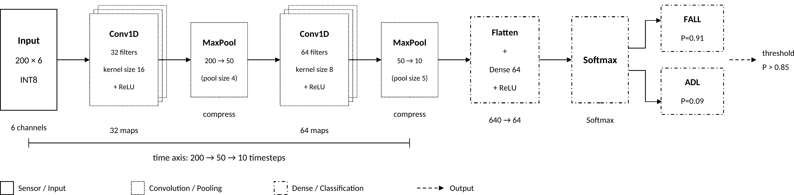
<figcaption>SPARK 1D CNN architecture: two Conv1D+MaxPool blocks
compress the 200-sample IMU window to a 12-step feature map, which is
flattened and classified by a Dense+Softmax head. INT8 quantized for
TFLite Micro deployment.</figcaption>
</figure>

### INT8 Quantization and Firmware Integration

Post-training INT8 quantization is applied via the TFLite Converter with
a representative calibration dataset (200 randomly sampled training
windows). The quantized TFLite model is exported as a C byte array using
the `xxd -i` command and included in the PlatformIO build as a header
file. Model size target: $\leq$ 120 KB flash.

## Gateway Software Implementation

### Backend and Database

The FastAPI/Uvicorn backend exposes REST endpoints for event ingestion,
profile management, and report generation. A Mosquitto MQTT consumer
thread runs within the FastAPI process, subscribing to `spark/events`
and persisting each `CONFIRMED_FALL` event to the PostgreSQL
`fall_events` table (schema defined in Chapter 3, Table 3.1). The SHAP
attribution pipeline (Section [5.6.2](#sec:shap){reference-type="ref"
reference="sec:shap"}) is invoked as a post-insert task, updating
`shap_top_feature` and `shap_json` columns before the Telegram alert is
dispatched.

### SHAP Attribution Pipeline {#sec:shap}

For each confirmed fall event, the gateway extracts the six peak IMU
channel values (three accelerometer axes $a_{x}, a_{y}, a_{z}$ and three
gyroscope axes $\omega_{x}, \omega_{y}, \omega_{z}$, each taken at peak
magnitude) from the 2-second event window and computes SHAP attributions
using the `shap` library against the trained CNN (loaded as a TFLite
interpreter on the gateway). The KernelExplainer or GradientExplainer is
used depending on benchmark latency on the RPi 4B. The top contributing
feature (e.g., $a_{z,\text{peak}}$, contribution 42%) is stored in
`shap_top_feature` and the full 6-element SHAP vector is stored in
`shap_json` (JSONB). Both fields are displayed on the Streamlit
dashboard per event and included in the auto-generated PDF report.

### Telegram Alert

The python-telegram-bot library dispatches a Telegram message to the
configured caregiver group within 2 seconds of `CONFIRMED_FALL` event
ingestion. The message includes: patient identifier, event timestamp
(ISO 8601 local time + UTC offset), fall severity score (1--5), Layer 2
CNN confidence (as percentage), and the SHAP top-contributing IMU
channel.

### Streamlit Dashboard

The dashboard provides: (1) a live accelerometer magnitude plot (last 10
seconds, 100 Hz WebSocket stream via FastAPI), (2) a fall event log
table (most recent 50 events with timestamp, severity, confidence, SHAP
top feature, and false-positive dismiss button), (3) a sensitivity
profile selector (HighSensitivity / Standard / SportMode), and (4) a
"Generate Report" button triggering PDF incident report generation for
the selected event.

### PDF Incident Report

ReportLab generates a one-page PDF clinical incident report per fall
event, containing: institution header (KEC), patient identifier, event
timestamp, fall severity score, Layer 2 CNN confidence score, SHAP
top-contributing feature, full SHAP vector bar chart, and a signature
block for care staff acknowledgement. The report format is modelled on
the clinical incident reporting structure recommended by WHO
[@who2007falls] for fall event documentation.

## Testing and Evaluation Plan

### Unit Testing

Each subsystem is validated independently before integration: (1)
MPU6050 ISR correctness verified by comparing 100 Hz output against
known waveforms from a signal generator; (2) Layer 1 threshold logic
verified by injecting synthetic $|a|$ sequences with known fall/non-fall
labels; (3) Layer 2 TFLite Micro inference verified by comparing ESP32
INT8 outputs against Python FP32 reference on 50 held-out windows; (4)
MQTT payload verified by Wireshark capture; (5) Telegram alert latency
measured from MQTT publish to message receipt timestamp.

### End-to-End Latency Measurement

A GPIO pin on the ESP32 is toggled at Layer 1 `PRE_FALL` and at
`CONFIRMED_FALL` MQTT publish, captured on an oscilloscope to measure
on-device pipeline latency. Telegram message receipt timestamp is
recorded manually. Target: on-device $\leq$ 200 ms, Telegram alert
$\leq$ 2 seconds from fall event.

### ADL False-Positive Battery

One hundred ADL sequences (walk, run, stair-climb, sit-to-stand, bend,
drop object, vigorous arm swing) are performed wearing the node. The
false-positive rate at Standard sensitivity profile is measured and
documented. Target: false-positive rate $\leq$ 10% on the ADL battery.

### CNN Performance Evaluation

The held-out test set (10% of combined dataset, stratified by subject)
is used to compute Sensitivity, Specificity, F1-score, AUC-ROC, and
confusion matrix. Results are reported for both the FP32 Keras model and
the INT8 TFLite Micro model to quantify quantization accuracy loss.

# [Expected Output]{.smallcaps} {#chap:expected_output}

This chapter describes the deliverables, performance targets, and
project schedule for SPARK. The system is developed in three sequential
phases: proposal and planning (June--July 2026), skill development and
dataset preparation (July--August 2026), and core build, integration,
and evaluation (September 2026 -- March 2027).

## Deliverables

SPARK produces the following tangible deliverables by the March 2027
demonstration deadline:

### Hardware Deliverables

1.  **Functional wearable node** : ESP32 DevKit V1 with MPU6050 6-axis
    IMU, 18650 LiPo battery, TP4056 charger module, AMS1117-3.3 LDO
    regulator and INA219 power telemetry sensor, mounted in a wrist or
    chest enclosure 3D-printed in PLA at KEC Makerspace.

2.  **Gateway unit** : Raspberry Pi 4B (4 GB, KEC unit or separately
    procured) running the complete SPARK gateway stack (Mosquitto,
    FastAPI/Uvicorn, PostgreSQL, Streamlit, python-telegram-bot,
    ReportLab, SHAP pipeline).

3.  **Power characterization report** : INA219 telemetry measurements
    documenting active current draw, idle current draw, and estimated
    battery life (target: $\geq 25$ hours from 2000 mAh cell at Standard
    sensitivity profile).

### Software Deliverables

1.  **ESP32 firmware** (PlatformIO/Arduino C++) :MPU6050 ISR at 100 Hz,
    complementary filter, sliding window ring buffer, Layer 1 threshold
    pre-filter, Layer 2 TFLite Micro INT8 CNN inference, ArduinoJSON
    MQTT publisher, and MQTT-based sensitivity profile receiver.

2.  **Trained and quantized 1D CNN model** --- INT8 TFLite model file
    ($\leq 120$ KB) achieving Sensitivity $\geq 90\%$ and Specificity
    $\geq 90\%$ on the held-out test set, integrated as a C header array
    in the PlatformIO build.

3.  **Gateway backend** (Python 3.11+): FastAPI/Uvicorn REST API with
    MQTT consumer, PostgreSQL `fall_events` schema with SHAP columns,
    SHAP attribution pipeline (per-event, $< 200$ ms latency on RPi 4B),
    Telegram caregiver alert ($< 2$ s from fall confirmation), Streamlit
    clinical dashboard, and ReportLab PDF incident report generator.

4.  **Self-collected KEC Wearable Fall Dataset**: Minimum 500 labelled
    fall event windows and 2000 ADL windows recorded at KEC campus using
    the SPARK node, with subject metadata, published to GitHub under an
    open licence as "KEC Wearable Fall Dataset in Nepal Context."

5.  **GitHub repository** : Complete open-source repository containing
    firmware, gateway software, trained model, dataset, KiCad schematic
    (breadboard-level), and a reproducible README enabling replication
    of the full system.

## Gantt chart {#gantt-chart .unnumbered}

Table [\[tab:gantt\]](#tab:gantt){reference-type="ref"
reference="tab:gantt"} maps all major tasks to a 32-week schedule
spanning September 2026 through March 2027 (Phase 3 only). Weeks 1--8
correspond to September--October 2026; weeks 9--16 to November--December
2026; weeks 17--24 to January--February 2027; weeks 25--32 to March
2027. Filled cells ($\bullet$) indicate scheduled activity.

*Note: W1--W4 = September 2026; W5--W8 = October 2026; W9--W12 =
November--December 2026; W13--W16 = January--March 2027.*

::: thebibliography
99

World Health Organization, *WHO Global Report on Falls Prevention in
Older Age*. Geneva, Switzerland: World Health Organization, 2007.

Central Bureau of Statistics, Nepal, *National Population and Housing
Census 2021: Population Projection Report*. Kathmandu, Nepal: National
Statistics Office, Government of Nepal, 2021.

M. Kangas, A. Konttila, P. Lindgren, I. Winblad, and T. Jämsä,
"Comparison of low-complexity fall detection algorithms for body
attached accelerometers," *Gait & Posture*, vol. 28, no. 2,
pp. 285--291, 2008.

A. K. Bourke, J. V. O'Brien, and G. M. Lyons, "Evaluation of a
threshold-based tri-axial accelerometer fall detection algorithm," *Gait
& Posture*, vol. 26, no. 2, pp. 194--199, 2008.

A. Sucerquia, J. D. López, and J. F. Vargas-Bonilla, "SisFall: A fall
and movement dataset," *Sensors*, vol. 17, no. 1, p. 198, 2017.

O. Baños *et al.*, "mHealthDroid: a novel framework for agile
development of mobile health applications," in *Proc. 6th Int.
Work-Conf. Ambient Assisted Living and Daily Activities (IWAAL)*, 2014,
pp. 91--98.

Y.-H. Nho, J. G. Lim, and D.-S. Kwon, "Deep convolutional neural network
for fall detection using inertial sensor data from wearable devices,"
*IEEE Sensors J.*, vol. 21, no. 22, pp. 26305--26315, 2021.

Y. Wang, M. Chen, X. Wang, R. H. M. Chan, and W. J. Li, "LSTM-based fall
detection system using wearable sensors," *IEEE Sensors J.*, vol. 20,
no. 11, pp. 6107--6116, 2020.

R. David *et al.*, "TensorFlow Lite Micro: Embedded machine learning for
TinyML systems," in *Proc. Machine Learning and Systems (MLSys)*,
vol. 3, 2021, pp. 800--811.

A. Kumar, V. Sharma, and R. Singh, "Microcontroller-based fall detection
for elderly monitoring using a threshold-gated classifier on Arduino
Nano 33 BLE Sense," *Int. J. Embedded Syst. Appl.*, vol. 12, no. 1,
pp. 1--12, 2022.

S. M. Lundberg and S.-I. Lee, "A unified approach to interpreting model
predictions," in *Advances in Neural Information Processing Systems
(NeurIPS)*, vol. 30, 2017, pp. 4765--4774.

G. Yao *et al.*, "Interpretation of electrocardiogram heartbeat by CNN
and GRU," *Computational and Mathematical Methods in Medicine*,
vol. 2021, 2021.
:::

# [Appendix]{.smallcaps} {#appendix .unnumbered}

## A.1 Self-Collected Dataset Protocol {#a.1-self-collected-dataset-protocol .unnumbered}

The SPARK self-collected dataset is recorded at KEC campus using the
SPARK wearable node (ESP32 + MPU6050 at 100 Hz). All four team members
plus recruited volunteers act as subjects. The protocol defines four
fall types and five ADL types as listed below.

**Fall types (positive class):**

- Forward trip fall --- simulated stumble onto a crash mat

- Lateral fall (left) --- sideways fall onto crash mat

- Lateral fall (right) --- sideways fall onto crash mat

- Sitting-to-floor fall --- controlled seat loss from a chair

**ADL types (negative class):**

- Walking (normal pace, indoor)

- Running (moderate pace, corridor)

- Stair climbing (ascending and descending, KEC stairwell)

- Sit-to-stand transition (chair, rapid)

- Bending to pick up an object

Each fall is repeated a minimum of 5 times per subject. ADL sequences
are recorded in 2-minute continuous blocks. The node is worn on the
dominant wrist during all recordings. Raw CSV output is labelled using a
post-hoc annotation script keyed to the Layer 1 flag timestamp.

## A.2 ESP32 Hardware Connections {#a.2-esp32-hardware-connections .unnumbered}

  **Component**     **ESP32 Pin**      **Function**
  ----------------- ------------------ ----------------------------
  MPU6050 SDA       GPIO 21            I$^2$C Data
  MPU6050 SCL       GPIO 22            I$^2$C Clock
  MPU6050 VCC       3.3 V rail         Power
  MPU6050 GND       GND                Ground
  INA219 SDA        GPIO 21            I$^2$C Data (address 0x41)
  INA219 SCL        GPIO 22            I$^2$C Clock
  INA219 VIN+       After LDO output   Current sense (series)
  TP4056 OUT+       LDO AMS1117 IN     Battery regulated output
  AMS1117-3.3 OUT   ESP32 VIN          3.3 V regulated supply

  : Wearable Node Pin Connections

## A.3 PostgreSQL Schema {#a.3-postgresql-schema .unnumbered}

    CREATE TABLE fall_events (
        event_id           UUID PRIMARY KEY DEFAULT gen_random_uuid(),
        user_id            VARCHAR(64) NOT NULL,
        timestamp          TIMESTAMPTZ NOT NULL,
        layer1_flag        BOOLEAN NOT NULL,
        layer2_confidence  FLOAT NOT NULL,
        fall_confirmed     BOOLEAN NOT NULL,
        ax_peak            FLOAT,
        ay_peak            FLOAT,
        az_peak            FLOAT,
        severity_score     INT CHECK (severity_score BETWEEN 1 AND 5),
        shap_top_feature   VARCHAR(32),
        shap_json          JSONB,
        alert_sent         BOOLEAN DEFAULT FALSE,
        false_positive_flagged BOOLEAN DEFAULT FALSE
    );
