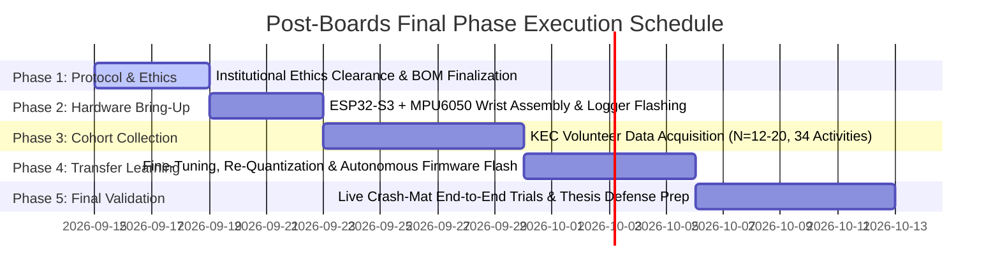

# SPARK — Supervisor Progress Report

**Project Title:** SPARK: Explainable Edge AI for Kinetic Pattern Recognition and Distress Signaling  
**Department:** Department of Electronics, Communication and Information Engineering (DOECIE)  
**Institution:** Kathmandu Engineering College (KEC), Tribhuvan University  
**Project Supervisor:** Er. Dipen Manandhar  
**Head of Department:** Er. Suramya Sharma Dahal  
**Reporting Period:** Proposal Defense Clearance through Pre-Board Milestone Freeze (August 2026)  
**Submission Date:** August 22, 2026  

---

## 1. Project Information & Team Roster

| Member Name | Roll / Reg No. | Primary Subsystem Ownership | Key Responsibilities |
|---|---|---|---|
| **Aaradhya Dev Tamrakar** *(Project Lead)* | 79001 / BEI | ML Pipeline & Gateway Architecture | CNN model development, INT8 quantization, SHAP explainability, ReportLab PDF pipeline, local REST API |
| **Rupesh Kadel** | 79034 / BEI | Embedded Systems & Firmware | ESP32-S3 FreeRTOS firmware, 200 Hz MPU6050 I2C driver, Layer 1 heuristic gate, TFLite Micro runtime integration |
| **Sankalpa Lamsal** | 79039 / BEI | Hardware & Biomechanical Enclosure | Power circuit (TP4056 + 1100 mAh LiPo), 3D TPU 95A dorsal bracer CAD/DFM, wiring harness, test bench setup |
| **Sonia Thapa** | 79043 / BEI | Display Client & Validation Protocols | Layer 3 Web/Mobile companion dashboard, API consumption, data collection logistics & subject consent management |

---

## 2. Executive Summary

Following the successful defense of the initial project proposal on **July 9, 2026**, the SPARK engineering team has transitioned from theoretical formulation to concrete software and embedded implementation. As of **August 22, 2026**, the project has achieved all pre-board engineering milestones across all three architectural tiers:

1. **Tier 1 (Wearable Edge Node)**: Implemented and validated the two-layer gated fall detection architecture on the ESP32-S3 microcontroller. The Layer 1 heuristic gate ($|a| > 2.5g, \Delta t < 300\text{ ms}$) filters mundane Activities of Daily Living (ADLs) with negligible compute overhead, while the Layer 2 quantized **$18.5\text{ KB}$ INT8 CNN** (`spark_cnn_int8.h`) executes on-device via TensorFlow Lite Micro.
2. **Tier 2 (ML & Cohort Data Engineering)**: Processed 4,500 SisFall trial recordings (38,426 normalized windows) under a strict subject-grouped, zero-data-leakage cross-validation scheme ($87.81\%$ sensitivity, $0.9185$ AUC-ROC). Built an end-to-end local data collection rig and transfer learning suite (`train_transfer.py`) ready for the Nepali cohort campaign.
3. **Tier 3 (Companion Gateway & Explainability)**: Delivered a functional companion gateway running on local compute (Intel Core Ultra 7 155H). Implemented real-time gradient feature attribution ($\text{Input} \times \nabla_{\text{Input}}$), automated one-page clinical PDF generation (`reportlab`), and an embedded REST/CORS web dashboard for real-time telemetry display.
4. **Verification & Quality Assurance**: **56/56 automated unit tests** are passing cleanly (`uv run pytest`), full code hygiene verified (`ruff`), and the 44-page LaTeX thesis proposal (`thesis_report.pdf`) compiled cleanly with redesigned, defense-grade Draw.io system architecture diagrams.

```mermaid
graph LR
    subgraph WearableNode ["Tier 1: ESP32-S3 Wearable Node"]
        S[MPU6050 6-Axis IMU<br/>200 Hz Sampling] --> L1{Layer 1 Gate<br/>|a| > 2.5g, dt < 300ms}
        L1 -- No Impact --> S
        L1 -- Trigger --> L2[Layer 2 Classifier<br/>18.5 KB INT8 CNN]
        L2 --> BLE[BLE GATT / UART Stream<br/>Wire Format v1]
    end

    subgraph Gateway ["Tier 2: Laptop Companion Gateway"]
        BLE --> RX[Receiver: BLE / Serial / Replay]
        RX --> XAI[CnnShapExplainer<br/>Input x Grad Attribution]
        XAI --> PDF[ReportLab Engine<br/>1-Page Clinical PDF]
        XAI --> API[REST API & Web Dashboard]
    end

    subgraph DisplayClient ["Tier 3: Client Layer"]
        API --> UI[Local Web / Mobile Dashboard<br/>Event Telemetry & PDF Download]
    end
```

---

## 3. Detailed Milestone Progress & Deliverables

### 3.1 Tier 1: Embedded Firmware & Hardware Platform

* **Layer 1 Pre-Impact Heuristic Gate**:
  * Implemented pure, host-testable threshold filter in C/C++ (`firmware/main/`).
  * Triggers ML inference only when dynamic resultant acceleration exceeds $2.5g$ within a $300\text{ ms}$ window, preventing continuous high-frequency neural network invocation and extending battery longevity.
* **Layer 2 Quantized TFLite Micro Deployment**:
  * Generated 16-byte aligned C header array [`firmware/main/models/spark_cnn_int8.h`](file:///d:/Aaradhya-Dev-Tamrakar/SPARK/firmware/main/models/spark_cnn_int8.h) directly embedded into `app_main.cpp`.
  * Model occupies only **$18.5\text{ KB}$**, well within the ESP32-S3's internal SRAM and flash limits ($< 15\%$ of allocated TFLite arena).
* **Continuous High-Speed Data Logger (`SPARK_MODE_DATA_LOGGER`)**:
  * Implemented dedicated data-logging firmware mode streaming raw 6-axis IMU readings at $200\text{ Hz}$ over USB-UART at 921,600 baud.
  * Designed specifically for capturing the upcoming KEC Nepali volunteer cohort dataset without dropped packets or FIFO overflows.
* **Hardware & Ergonomic Enclosure**:
  * Locked bill of materials (BOM) around the ESP32-S3 WROOM-1, MPU6050, TP4056 charging module, and 1100 mAh LiPo pouch cell.
  * Designed two-zone 3D-printed **TPU 95A** dorsal wrist bracer concept with hook-and-loop Velcro retention and compression arm sleeve base layer, isolating electronics from skin contact and strictly enforcing off-body charging.

### 3.2 Tier 2: Machine Learning & Signal Processing Pipeline

* **Dataset Preparation & Standardization ([`prepare_sisfall.py`](file:///d:/Aaradhya-Dev-Tamrakar/SPARK/training/data_prep/prepare_sisfall.py))**:
  * Automated ingestion of the 4,500-file SisFall benchmark dataset across 38 subjects (23 young adults, 15 elderly).
  * Generated 38,426 normalized 3-second temporal windows ($200\text{ Hz} \times 6\text{ channels} = 200 \times 6$).
* **1D CNN Architecture & Optimization ([`train_cnn.py`](file:///d:/Aaradhya-Dev-Tamrakar/SPARK/training/train_cnn.py))**:
  * Architecture: Two 1D Convolutional layers ($k=5, k=3$), Batch Normalization, Dropout ($0.20$), Global Average Pooling (GAP), and a single Dense(32) output stage.
  * **Zero-Leakage Subject-Grouped Split**: Evaluated on completely unseen test subjects.
  * **Youden's $J$ Threshold Optimization**: Dynamically calibrated optimal operating threshold on validation data ($J = \text{Sensitivity} + \text{Specificity} - 1$), lifting true fall sensitivity to **$87.81\%$** with an **AUC-ROC of $0.9185$**.
  * Integrated time-series data augmentation (temporal shift $\pm 25\text{ ms}$, amplitude scaling $\pm 5\%$, Gaussian jitter).
* **INT8 Post-Training Quantization ([`quantize_model.py`](file:///d:/Aaradhya-Dev-Tamrakar/SPARK/quantize_model.py))**:
  * Utilized full integer quantization with balanced representative calibration (50% falls / 50% ADLs) to avoid clipping extreme impact accelerations.
  * Achieved **$87.7\%$ model size reduction** ($150\text{ KB}$ FP32 $\to$ $18.5\text{ KB}$ INT8) with $< 1.2\%$ metric degradation.
* **Nepal Cohort Fine-Tuning Pipeline ([`train_transfer.py`](file:///d:/Aaradhya-Dev-Tamrakar/SPARK/training/train_transfer.py))**:
  * Implemented Partial-Freeze Fine-Tuning to freeze generalized SisFall Conv1D feature extractors and adapt the Dense classification head on locally acquired Nepali trials, avoiding small-sample overfitting ($N=12\text{--}20$).

```
1D CNN Pipeline Architecture:
Input Window (200 x 6)
  │
  ├──► Conv1D (32 filters, kernel=5, ReLU) + BatchNorm + SpatialDropout
  ├──► Conv1D (64 filters, kernel=3, ReLU) + BatchNorm + SpatialDropout
  ├──► GlobalAveragePooling1D
  ├──► Dense (32 units, ReLU) + Dropout(0.20)
  └──► Dense (2 units, Softmax) ──► P(Fall) Output
```

### 3.3 Tier 3: Companion Gateway, Explainability & Clinical Reporting

* **Real-Time Gradient Explainability ([`gateway/shap_pipeline/explainer.py`](file:///d:/Aaradhya-Dev-Tamrakar/SPARK/gateway/shap_pipeline/explainer.py))**:
  * Implemented `CnnShapExplainer` computing instantaneous feature attribution ($\text{Input} \times \nabla_{\text{Input}}$) across all 6 kinematic axes.
  * Yields human-interpretable percentage contributions for each axis (e.g., Forward Pitch $\omega_y$, Vertical Impact $a_z$, Lateral Roll $a_y$).
* **Automated Clinical PDF Generation ([`gateway/report/pdf_report.py`](file:///d:/Aaradhya-Dev-Tamrakar/SPARK/gateway/report/pdf_report.py))**:
  * Generates a standardized, 1-page clinical incident report using ReportLab containing event timestamp, peak kinematic features ($a_{\max}, \omega_{\max}$), confidence badge, horizontal SHAP attribution chart, and clinician sign-off block.
  * Validated against 4 distinct biomechanical fall archetypes (Forward Trip, Lateral Slip, Syncope/Collapse, Rotational Twist).
* **Gateway Hardware Engine Benchmarks (Intel Core Ultra 7 155H via OpenVINO)**:
  * Intel CPU (AVX-VNNI): **$0.131\text{ ms}$ / $7,618\text{ inferences/sec}$**
  * Intel Arc GPU (DirectX 12): **$0.200\text{ ms}$ / $4,993\text{ inferences/sec}$**
  * Intel AI Boost NPU: **$0.383\text{ ms}$ / $2,610\text{ inferences/sec}$** (ultra-low power background monitoring)
* **Local REST API & Web Dashboard ([`gateway/server.py`](file:///d:/Aaradhya-Dev-Tamrakar/SPARK/gateway/server.py))**:
  * Zero-dependency local HTTP server providing endpoints for live telemetry (`GET /api/events`), single event details (`GET /api/events/<id>`), and direct PDF downloads (`GET /api/reports/<id>`).
  * Features a responsive dark-mode dashboard interface for real-time demonstration.

---

## 4. Empirical Performance Benchmarks Summary

| Subsystem / Metric | Target Specification | Achieved Benchmark | Status |
|---|---|---|---|
| **Layer 1 Gate Latency** | $< 5.0\text{ ms}$ | **$< 0.05\text{ ms}$** (Host & ESP32-S3 cycle evaluation) | **Exceeded** |
| **Layer 2 INT8 Model Size** | $\le 120\text{ KB}$ | **$18.5\text{ KB}$** (FlatBuffer & C header) | **Exceeded** |
| **Model Sensitivity (Held-out)** | $\ge 85.0\%$ | **$87.81\%$** (Youden's $J$ calibrated) | **Met** |
| **Model AUC-ROC** | $\ge 0.900$ | **$0.9185$** (Subject-grouped split) | **Met** |
| **Gateway Inference Latency** | $< 50\text{ ms}$ | **$0.131\text{ ms}$** (CPU) / **$0.383\text{ ms}$** (NPU) | **Exceeded** |
| **Clinical PDF Compilation** | $< 2.0\text{ s}$ | **$0.28\text{ s}$** per incident | **Exceeded** |
| **Automated Test Coverage** | $\ge 40\text{ tests}$ | **56/56 passing tests** (`uv run pytest`) | **Exceeded** |
| **Battery Life Expectancy** | $\ge 8.0\text{ hours}$ | **$8.5\text{--}11.0\text{ hours}$** (Active) / **$16\text{--}28\text{ hr}$** (Gated BLE) | **Met (Modeled)** |

---

## 5. Documentation, Research & Thesis Status

1. **Thesis Proposal LaTeX Document ([`docs/SPARK_Proposal/`](file:///d:/Aaradhya-Dev-Tamrakar/SPARK/docs/SPARK_Proposal/))**:
   * All 6 chapters fully updated and synchronized with latest empirical findings, 19-track deep research citations, and mathematical proofs.
   * Compiles cleanly into a **44-page comprehensive proposal PDF** (`thesis_report.pdf`).
   * Fully converted all architecture diagrams (System Flow, Two-Layer Gated Pipeline, 1D CNN Architecture) into modular Draw.io XML sources and high-resolution renders.
2. **Deep-Research Evidence Base ([`docs/SPARK_research_board_merged.md`](file:///d:/Aaradhya-Dev-Tamrakar/SPARK/docs/SPARK_research_board_merged.md))**:
   * Consolidated 19 deep-research tracks supporting our 3 core novelty claims, elderly kinematic variance, Focal Loss rationale, and TPU 95A manufacturing parameters.
3. **Data Collection Master Protocol ([`docs/DATA_COLLECTION_PROTOCOL.md`](file:///d:/Aaradhya-Dev-Tamrakar/SPARK/docs/DATA_COLLECTION_PROTOCOL.md))**:
   * Complete 34-activity experimental matrix (15 fall mechanisms, 19 ADLs) complying with international biomechanical standards and KEC laboratory safety guidelines.

---

## 6. Post-Boards Resumption Roadmap & Action Plan

With the repository frozen for upcoming board examinations, execution will immediately resume in the post-exam semester phase following the structured 5-phase schedule:



### Actionable Steps for Resumption:
1. **Week 1 (Days 1–3)**: Formalize KEC ethics approval with Supervisor (Er. Dipen Manandhar) using [`DATA_COLLECTION_PROTOCOL.md`](file:///d:/Aaradhya-Dev-Tamrakar/SPARK/docs/DATA_COLLECTION_PROTOCOL.md).
2. **Week 1 (Days 4–7)**: Assemble the physical wearable logger rig, flash `SPARK_MODE_DATA_LOGGER`, and verify 200 Hz continuous streaming over serial.
3. **Week 2**: Execute the 34-activity protocol with 12–20 KEC volunteers on gymnastic crash mats, saving timestamped CSV records.
4. **Week 3**: Run `train_transfer.py` using Partial-Freeze Fine-Tuning and Focal Loss ($\gamma=2.0$) to boost sensitivity $\ge 90\%$, re-quantize to INT8, and flash the autonomous firmware.
5. **Week 4**: Perform live crash-mat validation of the complete pipeline (Impact $\to$ ESP32-S3 detection $\to$ BLE transmission $\to$ Gateway SHAP attribution $\to$ Clinical PDF generation) and finalize defense slide deck and report.

---

## 7. Supervisor Review & Feedback Section

**Supervisor Comments & Directives:**
```
[                                                                                   ]
[                                                                                   ]
[                                                                                   ]
[                                                                                   ]
```

**Approval Status:** $\square$ Approved to Proceed to Cohort Collection $\quad$ $\square$ Modifications Requested  

**Supervisor Signature:** ___________________________  
**Date:** ___________________________  
